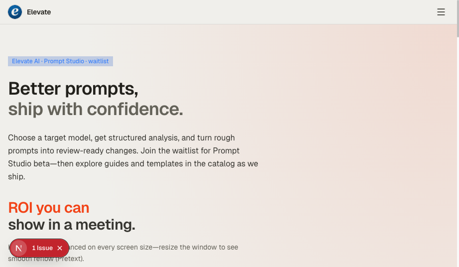
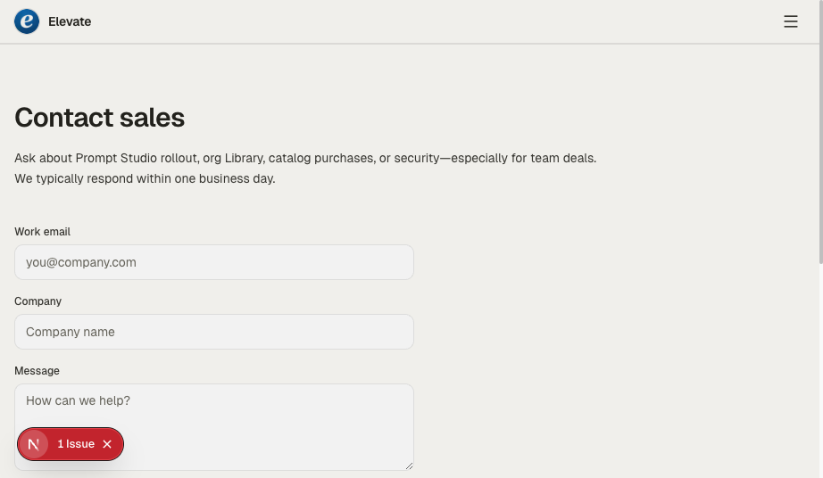
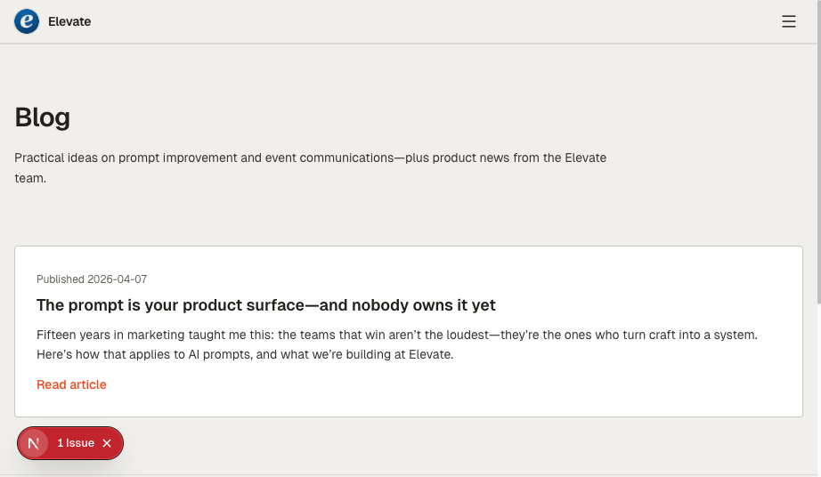
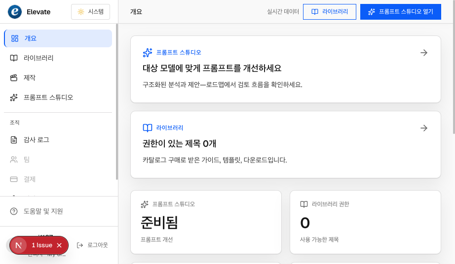
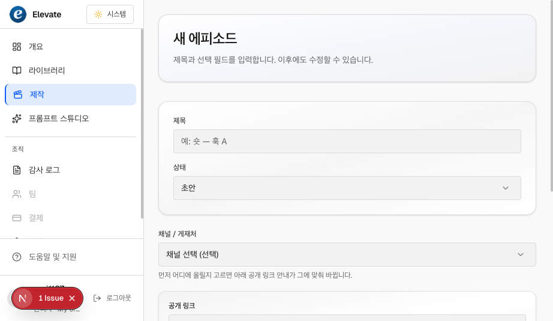
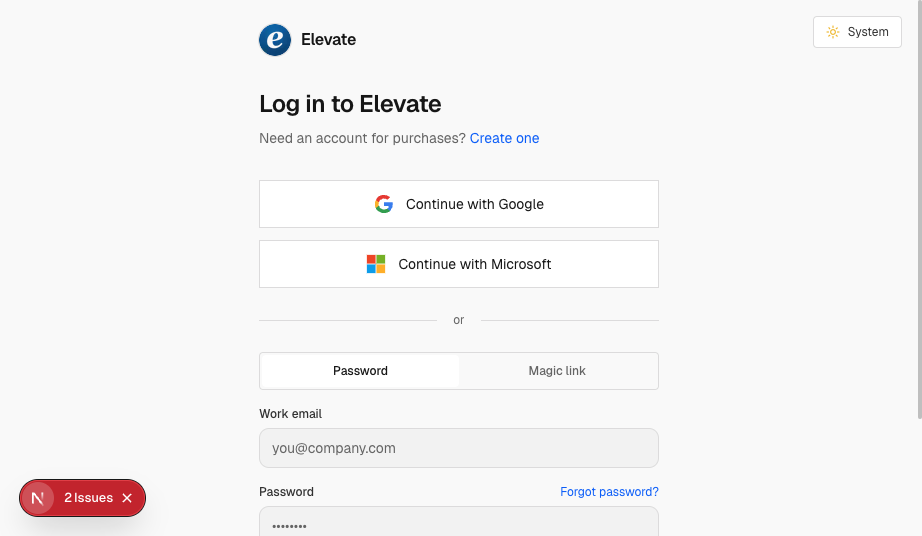

# Design & UX audit report — Elevate

**Date:** 2026-04-06 · **Live capture supplement:** 2026-04-08  
**Scope:** Static codebase review + design documentation (`docs/design/*`, `globals.css`, representative layouts and primitives), **plus** live viewport screenshots from a local dev server via **Cursor IDE browser** (MCP).

**Method:** Repository structure, token usage, component coverage, pattern drift (e.g. `rounded-sm` vs `rounded-lg`), alignment with documented surface modes (marketing chrome vs app shell vs auth). Visual pass: `http://localhost:3000` — marketing home, contact, blog, dashboard overview (authenticated session), productions “new episode” form, login.

**Live capture caveat:** Red **“N · N Issue(s)”** badges are the **Next.js development overlay**, not product chrome. They may obscure corners in screenshots; treat as environment noise unless the same artifact appears in production.

**Dev / hydration (audit tooling):** The Cursor IDE **browser MCP** injects `data-cursor-ref` on nodes for automation. That attribute is **not** rendered by this app (there are **no** `data-cursor-ref` usages in the repository). If the terminal shows *“A tree hydrated but some attributes… didn’t match”* and the diff is only `data-cursor-ref`, treat it as **tooling noise** when reproducing with Cursor’s browser (the stack may name `ProductionEpisodeWorkbenchInner` even though the mismatch is still injection-only). For a clean hydration check, use a normal browser session or `pnpm build && pnpm start` without DOM instrumentation.

---

## Executive summary

| Question | Verdict |
|----------|---------|
| Is design **directionally unified**? | **Yes, with a deliberate split**: marketing uses warm cream + orange CTA (`elevate-marketing-chrome`); product shell uses IBM-style blue + neutral layers. Documented in [`SYSTEM.md`](SYSTEM.md). |
| Is the **design system “appropriately implemented”**? | **Partially mature**: tokens and primitives (`Button`, `Card`, `Input`, `Textarea`, `variant="marketing"`) exist; **many surfaces still use ad-hoc `rounded-sm` and raw inputs** instead of shared primitives. |
| **Modern / competitive** headroom? | **Yes**: typography scale, motion system, data-density guidelines, and accessibility **checklists** are not yet fully codified; evolution is incremental-friendly. |
| **Fundamental UX redesign** required? | **Not as the default next step.** Incremental hardening (primitive adoption, radius/shadow consistency, IA review) matches current harness + [`QUALITY_PIPELINE.md`](QUALITY_PIPELINE.md). A **full redesign** is justified only with a **product or brand contract change**, or evidence of systemic usability failure (not established from code alone). |

---

## Live browser screenshots (2026-04-08)

Assets live under [`audit-screenshots/`](audit-screenshots/) (repository-relative to this file).

### Marketing (warm chrome, orange accents, Pretext hero)

*Home (`/`). Cream canvas, blue badge, two-tone headlines, orange ROI line — matches documented marketing mode.*

*Contact (`/contact`). Shared input/textarea styling; primary action below the fold in this viewport.*

*Blog (`/blog`). Sparse index; orange “Read article” link aligns with marketing CTA color.*

### Product shell (blue primary, cards, sidebar — session: Korean UI)

*Dashboard (`/dashboard`). Blue active nav, white cards, sparkline/stat tiles — intentional **product blue** vs marketing orange.*

### Dense forms (productions)

*`/dashboard/productions/new` (full-page capture). Card-grouped form; select + text fields show the **radius/input** story called out in §2 (mix of control types).*

### Auth (split layout)

*Login (`/login`). SSO rows, Password / Magic link tabs, shared input treatment.*

---

## 1. What is working well

1. **Layered harness** — Root `DESIGN.md` pointer, `SYSTEM.md`, `elevate-cursor-alignment.md`, vendored Cursor `DESIGN.md`, and [`QUALITY_PIPELINE.md`](QUALITY_PIPELINE.md) give humans and agents a **single narrative** for where tokens live and how gstack reviews fit.
2. **Clear surface modes** — Marketing layout wraps `elevate-marketing-chrome`; dashboard/admin use app tokens; auth is intentionally lighter. Reduces “one palette everywhere” confusion.
3. **Semantic CSS variables** — `globals.css` + `@theme` bridge support light/dark and marketing overrides (e.g. dark marketing canvas).
4. **Primitives exist** — Shared `Button` (including `marketing`), `Card` with elevation, `Input`/`Textarea` adopted on auth and contact; dashboard overview and library use `Card` patterns.
5. **Verification gate** — `pnpm verify` enforces a **minimum engineering quality bar**; design consistency is not automated but **process** is documented.

---

## 2. Gaps and inconsistencies (evidence-based)

### 2.1 Radius and elevation drift

- **`rounded-sm`** still appears in places such as **admin clients**, **studio forms**, **blog MDX**, **select/field-select** — while **`Card` / `Input` use `rounded-lg`** per recent DS work. **Post-audit pass:** auth alerts / tabs, **theme toggle**, **sign-out**, **OAuth** primary buttons, and **login** skeleton were moved toward **`rounded-md` / `rounded-lg`** for alignment with tokens.  
- **Impact:** Subtle “Frankenstein” feel on dense forms; not broken, but **not one radius scale enforced in code** everywhere yet.

### 2.2 Form controls: primitive vs bespoke

- **Login / signup / forgot / update-password / contact** use shared **`Input`**.  
- **Studio / productions-style forms** (`studio-productions-forms.tsx` and related) still use **longhand `className` on native inputs** (`rounded-sm`, manual focus rings).  
- **Impact:** Duplicate styling, slower future theme changes, higher risk of **focus/keyboard** inconsistency.

### 2.3 Marketing article and shared components

- `MarketingArticle` uses `border-border-subtle` under the chrome; inherited `--border-subtle` from `.elevate-marketing-chrome` is **likely correct** — worth **one visual pass** to confirm warm borders on blog/legal long-form.

### 2.4 Dual visual identity (intentional vs confusing)

- **Marketing:** orange primary CTA (`variant="marketing"`), cream canvas.  
- **Product UI:** blue `--primary`, sparklines and previews stay “product blue.”  
- **Impact:** Coherent **if** copy and onboarding explain Elevate brand vs “inspired-by” marketing; **risk** if users expect orange inside the app. Document in brand/onboarding if not already.

### 2.5 Motion, illustration, empty states

- Motion is mostly **CSS keyframes** (e.g. pretext hero); no **documented motion scale** (duration, easing) in DS.  
- Empty states and loading patterns are **per-page** — acceptable for MVP, but **modern polish** often standardizes skeletons and empty illustrations.

### 2.6 Accessibility (code-level signal only)

- Focus styles exist on `Button` and `Input`; full **WCAG audit** (contrast pairs for marketing orange on cream, keyboard traps in modals, live regions) was **not** run in this pass. Treat as **follow-up** with axe or Lighthouse on critical paths.

---

## 3. “Modern design” — where to evolve (without full redesign)

| Area | Suggestion |
|------|------------|
| **Typography** | Optional display scale for marketing H1–H3 (still Geist); avoid custom licensed fonts until legal clearance. |
| **Density** | Optional second vendored `DESIGN.md` (e.g. data-dense) for **dashboard** only — [`SYSTEM.md`](SYSTEM.md) P4 already defers this to product decision. |
| **Components** | Gradually replace bespoke inputs with **`Input`/`Textarea`**; align **`Select`** / **`field-select`** radius with `Input`. |
| **Tables** | Admin tables are **custom HTML + utilities** — consider a thin **`Table`/`DataTable`** primitive for spacing, hover, and focus consistency. |
| **Motion** | Add a short **“Motion” subsection** to `SYSTEM.md` (max 2–3 durations, prefers-reduced-motion). |

---

## 4. Verdict: fundamental UX redesign?

**Recommendation: no — not as the default.**

**Reasons:**

1. The product already has a **documented DS split** (marketing vs app) and **incremental backlog** in `SYSTEM.md`.  
2. Pain points observed are **consistency and primitive adoption**, not absence of information architecture in code.  
3. A **ground-up redesign** is expensive and only clearly justified when:  
   - North Star / GTM changes (see `memory-bank/creative-elevate-ai-pivot.md`),  
   - Brand/legal commitment to a new visual system, or  
   - Qualitative research shows **task failure** on core flows (Prompt Studio, Library, billing).

**When to revisit “full redesign”:** After **user research + analytics** (e.g. PostHog funnels in [`docs/POSTHOG_FUNNELS.md`](../POSTHOG_FUNNELS.md)) and/or **`/plan-ceo-review`** + **`/plan-design-review`** on a **scoped** problem (e.g. onboarding only), not the whole app at once.

---

## 5. Recommended next steps (prioritized)

1. **Unify form controls** — Migrate studio/productions forms to `Input` / `Textarea` where possible; normalize `rounded-lg`.  
2. **Radius lint or checklist** — Either ESLint `no-restricted-syntax` for raw `rounded-sm` outside legacy exceptions, or a **short checklist** in PR template.  
3. **Visual QA pass** — **Partially done** (2026-04-08): marketing home, contact, blog, dashboard overview, login, productions new episode — see **Live browser screenshots** above. Remaining: **dark mode** toggle pass, **admin** surface, and **production** URL without dev overlay if needed for stakeholder review. Optional: gstack **`/browse`** or **`/qa`**.  
4. **Accessibility sample** — Lighthouse or axe on `/`, `/login`, `/dashboard`, `/dashboard/library`.  
5. **Optional** — Add **motion** notes to `SYSTEM.md`; consider **table primitive** when admin tables grow.

---

## 6. Document control

| Field | Value |
|-------|--------|
| Owner | Product / design / eng (shared) |
| Next review | After major surface change or Q3 2026 (suggested) |
| Related | [`SYSTEM.md`](SYSTEM.md), [`QUALITY_PIPELINE.md`](QUALITY_PIPELINE.md), [`AI_ORCHESTRATION.md`](../AI_ORCHESTRATION.md) |
| Screenshots | [`audit-screenshots/`](audit-screenshots/) (2026-04-08, Cursor browser MCP) |
