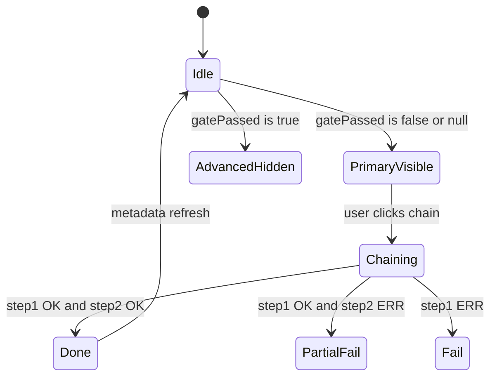

# PLAN — Content queue: Claude × review_gate 통합 UX

**상태:** 구현 참고용 (PLAN / CREATIVE 입력 문서)  
**관련 코드:** `evaluateReviewGate` · `metadata.review_gate` · `requestClaudeContentReview` · `applyClaudeContentRevision` · `ContentQueueClaudeForms` · `ContentQueueEditorBody`  
**목표:** 미통과 시 Claude를 **주 경로**로 노출하고, 통과 시에는 **고급 메뉴**로만 노출; 선택적으로 **1→2 연쇄(원클릭)** 제공.

---

## 1. 용어·진실 공급원(SoT)

| 용어 | SoT | 비고 |
|------|-----|------|
| 게이트 통과 여부 | `metadata.review_gate.latest.passed` (boolean) | `readLatestReviewGate` / `readReviewGateSnapshot`과 정합 |
| 실패 사유 | `metadata.review_gate.latest.reasons[]` | UI·Claude 브리프 컨텍스트에 이미 사용 중 |
| 품질 점수 | `metadata.review_gate.latest.metrics.qualityScore` | 운영 신호·정책과 연동 가능 |
| 로컬 재계산 | `recomputeAdminContentItemReviewGate` | 본문·출처 링크 기준으로 `review_gate` 갱신 |

**분기 규칙(권장):**

- `passed === false` **또는** `passed == null`(스냅샷 없음) → **“게이트 미충족”**으로 취급해 Claude **주 경로** 노출.
- `passed === true` → Claude **고급에만** 노출 (아래 §4).

*(제품 정책에 따라 “스냅샷 없음 = 주 경로”를 “통과로 간주”로 바꿀 수 있음. 문서상 기본은 **보수적**: 없으면 편집 유도.)*

---

## 2. UX 모드 두 격자

### 2.1 주 경로 (Primary) — 게이트 미충족

**대상:** 큐 행 상세 시트, 검토·편집 다이얼로그, `/admin/content-queue/[id]`의 동일 블록.

**노출:**

1. 짧은 설명: “게이트 미통과 → 편집 브리프 생성 후 본문 반영 권장” (i18n).
2. **원클릭 연쇄(권장 라벨):** `Claude: 브리프 + 본문 반영` (또는 `검토 후 바로 반영`).
3. **보조:** 개별 `1단계만` / `2단계만`(브리프 이미 있을 때) — 접기 또는 `details`로 축소.

**금지/경고:**

- API 키 없음 → 기존 `missing_api_key` 메시지 유지.
- 연쇄 실패 시: 1단계 성공·2단계 실패는 **명시적 메시지** (아래 §6).

### 2.2 고급 (Advanced) — 게이트 통과

**대상:** 동일 위치이나 `<details>` / “고급 · Claude” 디스클로저 / 케밥 메뉴.

**노출:**

- 기존 2단계 버튼 세트(또는 동일한 서버 액션 호출).
- **힌트 카피:** “게이트는 통과했습니다. 스타일·톤 조정 등 선택적으로 사용하세요.”

**옵션 (정책):**

- `CONTENT_OPS_CLAUDE_WHEN_GATE_PASSED=false` 같은 **서버/env 플래그**로 고급까지 숨길지 결정 가능 (운영자 전용).

---

## 3. 상태 머신 (클라이언트·서버 경계)



**데이터 갱신:**

- 연쇄/단계 완료 후 `revalidatePath`는 기존 액션과 동일.
- 다이얼로그 내 `ContentQueueEditorBody`는 `getAdminContentItem` 재조회 또는 `router.refresh` + 상위 `setRow`로 **gate 표시**를 즉시 맞출 것 (이미 패턴 있음).

---

## 4. 컴포넌트 맵 (구현 시 터치 파일)

| 단위 | 역할 |
|------|------|
| `ContentQueueClaudeForms` | `gatePassed: boolean \| null` (또는 `showMode: "primary" \| "advanced"`) prop 추가; 조건부 레이아웃·카피 |
| `ContentQueueEditorBody` | `readLatestReviewGate(row.metadata)`로 모드 결정 후 props 전달 |
| 행 상세 `ContentQueueRowActions` 내 시트 | 동일: `row.metadata`만으로 분기 가능 |
| (선택) `admin-content-ops.ts` | `runClaudeReviewThenApply` 단일 server action — 트랜잭션·에러 코드 일원화 |

**권장 props (단일 진입):**

```ts
type ClaudeQueueUiMode = "primary" | "advanced";

// derived:
// primary = !latest?.passed  // treat missing as primary
// advanced = latest?.passed === true
```

---

## 5. 서버 액션 설계

### 5.1 옵션 A — 클라이언트에서 순차 호출 (변경 최소)

- `requestClaudeContentReview` 성공 후 같은 `formData`로 `applyClaudeContentRevision` 호출.
- **단점:** 두 번 왕복, 중간 실패 시 UI 동기화가 복잡.

### 5.2 옵션 B — 단일 액션 `runClaudeReviewThenRevision` (권장)

- 한 요청 안에서: (1) 현재와 동일한 브리프 저장 로직 (2) 직후 본문 반영 로직.
- **반환:** `ClaudeQueueActionState` 확장 권장 — 예: `{ status: "success", code: "chain_complete", truncation?: boolean }` + 기존 코드 유지.
- **부분 실패:** 1 성공·2 실패 시 `code: "revision_failed_after_review"` + `detail` (롤백 정책은 **비권장**: 브리프는 이미 메타데이터에 남김).

### 5.3 정책 가드 (선택)

- 게이트 **통과** 상태에서 단일 액션이 호출되면 `403`/`error` code `gate_already_passed` — 고급 UI에서만 보내도록 할지, 아니면 허용할지 제품 결정.

---

## 6. i18n (추가 키 후보 — `Dashboard.adminContentQueue.claude`)

네임스페이스는 기존 `claude.*` 확장; **5 로케일 동기** (`messages-locale-parity`).

| 키 | 용도 |
|----|------|
| `primary.title` | 미통과 전용 섹션 제목 |
| `primary.chainCta` | 원클릭 1→2 버튼 |
| `primary.gateReasonsHint` | 실패 사유 요약 표시 (선택) |
| `advanced.disclosureLabel` | “고급 · Claude” |
| `advanced.hintWhenGatePassed` | 통과 시 설명 |
| `chain.successBoth` | 연쇄 전체 성공 |
| `chain.failAfterReview` | 1 성공 2 실패 |

---

## 7. 접근성·운영

- 원클릭 연쇄는 **장시간 요청** — 버튼에 `aria-busy` / `isLoading` 패턴 (`Button` `isLoading`) 권장. *(2026-05-05: 미적용 — 후속 BUILD)*
- 실패 시 **스크린 리더**용 `role="status"` 메시지 유지 (`ContentQueueClaudeForms` 패턴 재사용).
- PostHog **P2**: `content_queue_claude_chain_started` / `content_queue_claude_chain_completed` / `content_queue_claude_chain_failed` — **구현됨** (`PostHogEvent` · `ContentQueueClaudeForms`; PostHog 미초기화 시 `capture` no-op).

---

## 8. 테스트 체크리스트 (Vitest / 수동)

1. `passed: false` → Primary에 연쇄 CTA 보임; Advanced 접힘 없음(또는 동일 블록 상단).
2. `passed: true` → Primary 숨김; Advanced 펼침 시에만 1·2 또는 연쇄.
3. `metadata.review_gate` 없음 → Primary (정책 §1).
4. `missing_api_key` → 모든 버튼 비활성 또는 기존 에러.
5. 연쇄 중 2단계만 실패 → 브리프는 저장됨, 본문 불변, 에러 메시지 명확.
6. 로케일 5개 parity.

**자동화 (Vitest):** `tests/unit/content-queue-claude-gate-ui.test.ts` — §8 항목 1·2·3에 해당하는 `gatePassedPropForClaudeForms` 분기. §8 4·5·관리자 UI는 수동 또는 추후 Playwright.

---

## 9. 롤아웃 단계 (슬라이스)

| Phase | 내용 | 상태 (2026-05-05 점검) |
|-------|------|------------------------|
| **P0** | `ContentQueueClaudeForms`에 gate 기반 Primary/Advanced 레이아웃 + 카피만 | **완료** |
| **P1** | 단일 server action 연쇄 + 에러 코드 (`chain_complete`, `revision_failed_after_review`) + i18n | **완료**; `aria-busy`/전용 로딩은 미완 |
| **P2** | env로 “통과 시 Claude 완전 비활성” / PostHog | **완료** — `CONTENT_OPS_CLAUDE_WHEN_GATE_PASSED` + `content_queue_claude_chain_*` ( [`src/lib/content-ops/claude-ui-policy.ts`](../../src/lib/content-ops/claude-ui-policy.ts) · [`ContentQueueClaudeForms`](../../src/components/admin/content-queue-claude-forms.tsx) ) |

---

## 10. Memory Bank 연동

- **BUILD 착수 시:** `memory-bank/tasks.md`에 한 줄 태스크 + 이 문서 링크.
- **REFLECT:** 게이트 오탐 시 운영자가 Advanced만 쓰는 빈도·불만 기록.

---

*END — 구현 세션에서 이 문서 §4·§5·§9를 그대로 체크리스트로 사용.*
