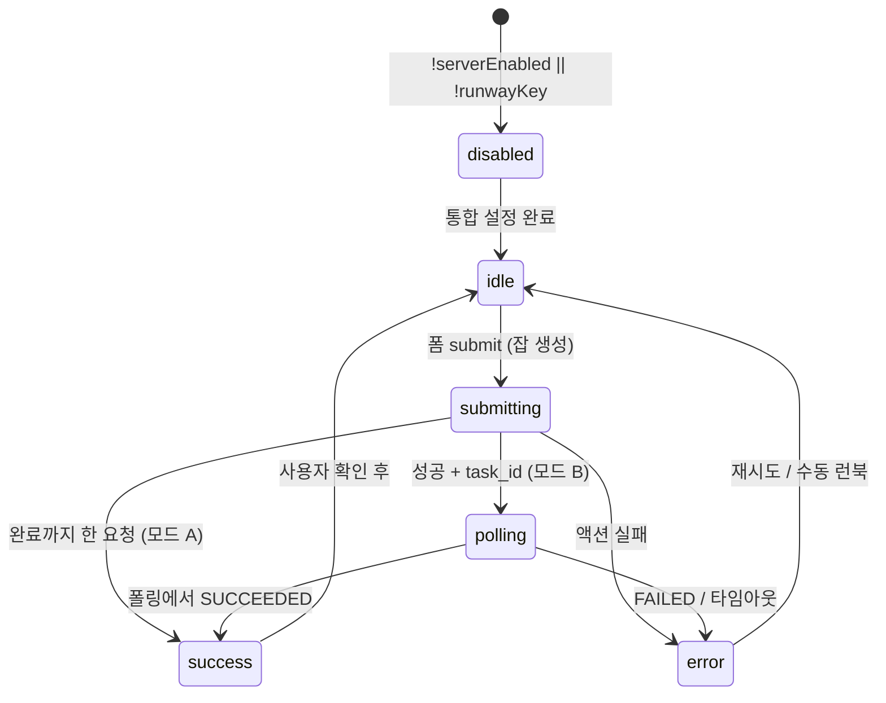

# PLAN: Runway Dev API — 엔드포인트 · 페이로드 · UI 상태머신

**목적:** `PLAN-studio-provider-integrations.md` **Phase 3** 중 **Runway만** 먼저 쪼개서 BUILD에 넘길 때의 단일 SoT.  
**관련:** [`ADR-006`](../adr/ADR-006-studio-provider-integrations-v2.md) · [`PLAN-studio-provider-integrations.md`](./PLAN-studio-provider-integrations.md) · [`STUDIO_PROVIDER_API_CAPABILITY_MATRIX.md`](./STUDIO_PROVIDER_API_CAPABILITY_MATRIX.md) · 코드 `src/lib/studio-integrations/providers/runway/` · [`docs/STUDIO_ARTIFACT_ROLES.md`](../STUDIO_ARTIFACT_ROLES.md)

**비목표 (이 PLAN에서 다루지 않음):** YouTube 업로드, Runway OAuth(키는 BYO만), 에피소드 초안 LLM 프롬프트 리팩터.

---

## 1. 제품·신뢰 경계

| 항목 | 결정 |
|------|------|
| 키 | 조직별 `studio_org_provider_connections.provider = runway` + `decryptProviderSecret` (기존과 동일) |
| 서버 호출 | `STUDIO_INTEGRATIONS_ENABLED === true` 일 때만 실제 Runway 호출 |
| 암호화 | `STUDIO_INTEGRATIONS_ENCRYPTION_KEY` 미설정 시 저장·복호화 불가 — 기존 통합 페이지와 동일 |
| 감사 | 잡 ID·최종 URL·에러 요약은 **아티팩트 `metadata` 또는 전용 행**에 남김 (아래 §4) |
| ToS / 쿼터 | 자동 생성 허용 여부는 제품·법무 확인 — 구현 전 [공식 이용·티어](https://docs.dev.runwayml.com/usage/tiers) 재확인 |

---

## 2. 외부 API (Runway Dev API) — 엔드포인트

**공통**

- **Base URL:** `https://api.dev.runwayml.com`
- **인증:** `Authorization: Bearer <api_key>` (`key_` + hex, 공백 제거는 `verifyRunwayApiKey`와 동일 패턴 권장)
- **버전 헤더 (필수):** `X-Runway-Version` — 코드 상수는 [`RUNWAY_API_VERSION`](../../src/lib/studio-integrations/runway-verify.ts) (`2024-11-06`) 와 **동일하게** 유지 (변경 시 한 곳에서만 올리기)

| 목적 | HTTP | 경로 / 사용처 | 비고 |
|------|------|----------------|------|
| 키·조직 확인 | `GET` | `/v1/organization` | 이미 [`runway-verify.ts`](../../src/lib/studio-integrations/runway-verify.ts) |
| (예상) 이미지→비디오 잡 생성 | `POST` | 공식 가이드·SDK가 노출하는 **image to video** 생성 엔드포인트 | **BUILD 직전** [API Reference](https://docs.dev.runwayml.com/api) 또는 `@runwayml/sdk` 타입으로 최종 경로·필드 확정 |
| 잡 상태·결과 | `GET` | `/v1/tasks/{task_id}` | SDK 주석과 동일 — 폴링에 사용 |

**구현 옵션 (BUILD에서 하나 선택)**

1. **공식 Node SDK `@runwayml/sdk`** — `imageToVideo.create({ ... }).waitForTaskOutput()` 패턴 ([문서 퀵스타트](https://docs.dev.runwayml.com/)) — 구현 속도·타입 안전성 우선 시.
2. **`fetch` + JSON** — 의존성 최소화; OpenAPI/문서와 필드 1:1 대조 필요.

**타임아웃:** Vercel 서버 액션 한 요청 제한을 고려해, **장시간 대기는 서버 한 번에 묶지 않는 편이 안전** (아래 §5).

---

## 3. 어댑터 `runStep` — 내부 페이로드 (제안)

현재 [`StudioProviderAdapter`](../../src/lib/studio-integrations/providers/types.ts)의 `runStep`은 `Record<string, unknown>` + 성공 시 `{ ok: true }`만 가정. Runway BUILD에서는 아래처럼 **구체화**한다.

**입력 (`args` — 서버 액션에서만 조립)**

| 필드 | 타입 | 필수 | 설명 |
|------|------|------|------|
| `episode_id` | `string` | ✅ | 에피소드 UUID |
| `organization_id` | `string` | ✅ | RLS·멱등에 사용 |
| `idempotency_key` | `string` | 권장 | `episode_id` + 해시된 입력 또는 클라이언트 `crypto.randomUUID()` 한 번 |
| `mode` | `"text_to_video" \| "image_to_video"` | ✅ | v1은 문서·런북과 맞게 **하나만** 먼저 (예: `image_to_video`만) |
| `model` | `string` | ✅ | 예: `gen4.5` — [모델 가이드](https://docs.dev.runwayml.com/guides/models) 기준 허용 목록 상수화 |
| `prompt_text` | `string` | 조건부 | 에피소드 `prompt` 아티팩트 또는 UI 필드에서 합성 |
| `prompt_image_url` | `string` | `image_to_video` 시 | 공개 URL 또는 Runway가 허용하는 스킴 |
| `ratio` | `string` | 권장 | 숏이면 `9:16` 계열(문서의 표기: 해상도 코드 vs 비율 문자열 — SDK 스키마 따름) |
| `duration` | `number` | 선택 | 초 단위 허용 값만 |

**출력 (discriminated union — 타입 확장)**

```ts
type RunwayRunStepResult =
  | { ok: true; task_id: string; output_urls: string[]; raw?: unknown }
  | { ok: false; code: "not_implemented" | "runway_api_error" | "timeout" | "missing_secret"; status?: number; message?: string };
```

- `output_urls`: Runway 태스크 완료 시 비디오(또는 첫 자산) URL 배열 — **에피팩트 `render_output` / `external_url`에 저장할 값**.

---

## 4. 데이터·아티팩트 — 서버가 쓰는 페이로드

**원칙:** v1 원장 모델 유지 — [`STUDIO_ARTIFACT_ROLES.md`](../STUDIO_ARTIFACT_ROLES.md).

| 시점 | 동작 |
|------|------|
| 잡 **제출 직후** | `studio_production_artifacts`에 `tool_platform: runway`, `artifact_role: render_output` (또는 진행 중이면 임시 role — 팀 합의) + `metadata`: `{ runway_task_id, status: "PENDING", idempotency_key }` |
| 잡 **성공** | 동일 행 업데이트: `content_text` = 최종 URL(들), `metadata.status: "SUCCEEDED"`, 완료 시각 |
| 잡 **실패** | `metadata`: `{ status: "FAILED", error_summary }` — 사용자에게는 i18n 메시지로 매핑 |

**스냅샷/히스토리:** 초안 스냅샷 테이블과 **혼동 금지** — Runway 잡은 **별도 “통합 실행” 로그**가 필요하면 ADR-006의 “integration run rows (table TBD)” 후보로만 설계하고, **P0는 아티팩트 + metadata로 충분**할 수 있음.

---

## 5. 서버 액션 vs 장시간 폴링 — 경계

| 방식 | 장점 | 단점 |
|------|------|------|
| **A. 단일 액션에서 `waitForTaskOutput()`까지** | UI 단순 (`useActionState` 하나) | 서버리스 타임아웃·비용 |
| **B. 액션1: create → `task_id` 반환 → 클라이언트가 폴링 액션2** | 타임아웃 회피 | 상태 UI·멱등 필요 |
| **C. 백그라운드 잡 + DB 폴링** | 확장성 | 마이그레이션·워커 |

**PLAN 권장:** MVP는 **B** (제출과 폴링 분리) 또는 SDK 대기가 **실측으로 60s 이내**로 안정적이면 **A**로 시작 후 모니터링. 문서에 선택한 옵션과 한계를 명시.

**폼 필드 (에피소드 패널 — `triggerRunwayRenderStub` 대체)**

- `episode_id` (hidden)
- 선택: `ratio`, `duration`, `model` (hidden defaults 가능)

---

## 6. UI 상태머신 (에피소드 초안 패널 하단 Runway CTA)

상태는 **클라이언트 로컬 state** + `useActionState` 결과로 표현한다. (`production-episode-draft-panel.tsx` 내 `rwState` / `rwPending` 확장.)



| 상태 | 사용자에게 보이는 것 |
|------|----------------------|
| `disabled` | CTA 비활성 또는 ghost + “통합에서 Runway 키 연결” — 앱 경로 `/dashboard/productions/integrations` (`src/app/(dashboard)/dashboard/productions/integrations/page.tsx`) |
| `idle` | “Runway로 렌더” (실연동 시 카피는 [`STUDIO_PROVIDER_API_CAPABILITY_MATRIX`](./STUDIO_PROVIDER_API_CAPABILITY_MATRIX.md) 가이드에 맞게) |
| `submitting` | 버튼 `isLoading` |
| `polling` | 진행 문구 + (선택) task id 일부 마스킹 |
| `success` | 토스트 또는 인라인: “링크가 에피소드에 저장됨” + 워크벤치 새로고침 |
| `error` | `translateActionErrorMessage` + 수동 [`RUNWAY_SHORTS_RUNBOOK.md`](../RUNWAY_SHORTS_RUNBOOK.md) 링크 유지 |

**PostHog:** `ELEVATE_STUDIO_EPISODE_RUNWAY_STUB_CLICKED`는 실연동 후 **성공/실패/단계별**로 이벤트 이름을 나누거나 props로 구분 — [posthog-integration 규칙](../../.cursor/rules/posthog-integration.mdc)에 맞게 **한 enum 파일**에만 추가.

---

## 7. 에러 코드 매핑 (i18n)

- 기존: `ActionErrorCode.studioRunwayManualOnly` — 스텁 전용.
- BUILD 시 추가 후보: `studioRunwayNotConfigured`, `studioRunwayTaskFailed`, `studioRunwayTimeout`, `studioIntegrationsDisabled` (이미 존재 시 재사용).

---

## 8. BUILD 체크리스트 (순서)

1. `runwayAdapter.runStep` — 실제 API 호출 + 위 결과 타입 (`src/lib/studio-integrations/providers/types.ts` 확장).
2. `getOrgLlmCredentialForProvider` 패턴으로 **`runway` 시크릿 로드** 헬퍼 (또는 기존 함수 일반화).
3. `triggerRunwayRenderStub` → **`submitRunwayRenderJob`** (및 필요 시 **`pollRunwayTask`**) in `studio-episode-llm.ts`.
4. 아티팩트 upsert + `revalidatePath` 에피소드.
5. `production-episode-draft-panel.tsx` — 상태머신 + 플래그/키 게이트.
6. [`STUDIO_PROVIDER_API_CAPABILITY_MATRIX.md`](./STUDIO_PROVIDER_API_CAPABILITY_MATRIX.md) 표 업데이트 + `pnpm verify`.

---

## 9. CREATIVE/법무 (BUILD 전 확인 1회)

- Runway **자동화 생성**이 팀 플랜·ToS에서 허용되는지.
- 생성물 **저장·재배포**에 필요한 라이선스 표기가 제품에 있는지 (외부 링크만 저장이면 경량).

이 문서가 승인되면 **BUILD**는 위 §8 순서로 진행하고, 외부 API 경로·필드는 **공식 문서/SDK 스냅샷**으로 최종 고정한다.
