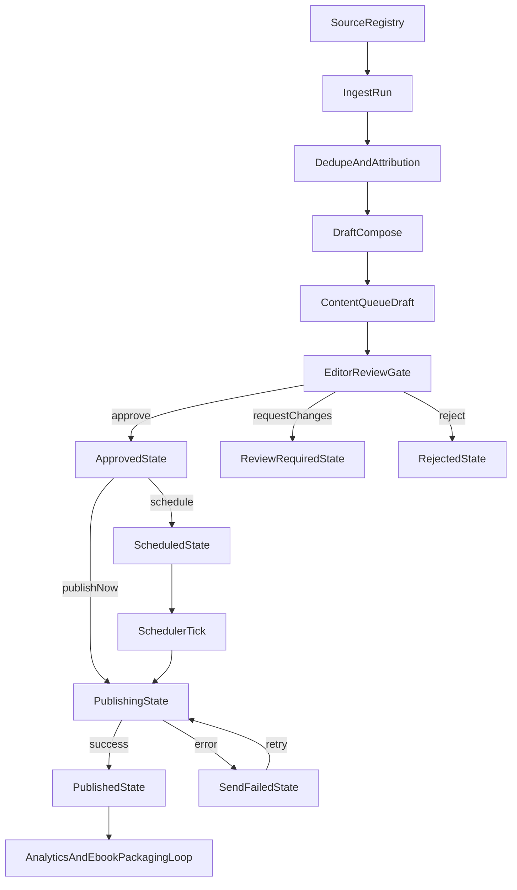

# Workflow — AI Content Ops (Ingest -> Review -> Publish)

## Objective

Lock the operational workflow for AI-assisted newsletter/blog content with explicit human review before delivery.

## End-to-End Flow

## State Machine (Content Item)

### Core states

- `draft`
- `review_required`
- `approved`
- `rejected`
- `scheduled`
- `publishing`
- `published`
- `send_failed`

### Transition rules

1. `draft` -> `review_required`
   - set automatically after generation, or manually by operator.
2. `review_required` -> `approved`
   - requires source attribution and non-empty content.
3. `review_required` -> `rejected`
   - reviewer note required.
4. `approved` -> `scheduled`
   - requires `scheduled_at`.
5. `approved` -> `publishing`
   - "Publish now" action.
6. `scheduled` -> `publishing`
   - scheduler trigger at/after `scheduled_at`.
7. `publishing` -> `published`
   - all selected publication channels succeed.
8. `publishing` -> `send_failed`
   - at least one channel fails.
9. `send_failed` -> `publishing`
   - explicit retry only.

## Quality Gate Contract

Before `approved`, enforce:

- at least one source link in `content_item_source_map`
- summary and body not empty
- plagiarism-safe policy: no raw copy/paste from source
- fact-check score threshold OR manual override note
- CTA presence check (for business objective consistency)

## Publication Contract

Channel behavior is independent by row in `content_publications`.

- `blog` channel:
  - writes/updates canonical blog entry from `content_items`
  - updates `published_at` on success
- `email` channel:
  - resolves active subscribers from `newsletter_subscribers`
  - sends via provider (Resend in MVP)
  - stores provider IDs and attempts

If one channel fails, item status is `send_failed`; successful channels remain recorded.

## Run Types and Orchestration

- `ingest`:
  - fetch sources, normalize entries, map attribution
- `draft_generate`:
  - create digest/blog drafts and queue as `draft`
- `review_gate`:
  - optional automated checks before human review
- `publish`:
  - process scheduled/approved entries

Each run writes to `content_runs` for observability and replay.

## Human-in-the-loop Rules

- No automatic external send from `draft` or `review_required`.
- `Publish now` requires prior `approved` state.
- Overrides are allowed but must leave review/audit notes.

## Recovery and Retry

- Delivery failures produce `send_failed` with `last_error`.
- Retries increment attempt counters in `content_publications`.
- Repeated failure threshold can move item to `review_required` for rework (phase 2 policy).

## Packaging Reuse Contract

Published content remains reusable:

- source-grounded snippets for future long-form synthesis
- newsletter editions as chapter candidates
- analytics signals as selection heuristic for ebook bundles
