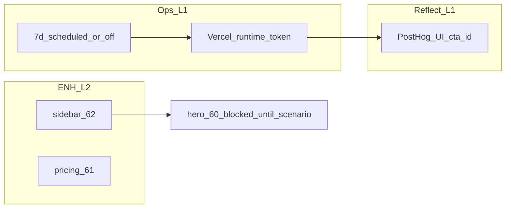

# Active Context — Elevate

**Agent workflow SoT (INIT→ARCHIVE, L1–L4, gstack 보조):** [`AGENTS.md`](../AGENTS.md) § **AI orchestration → Operating model** — 에이전트·인간 모두 **복잡도에 맞는 페이즈**를 생략하지 않음(사용자 fast path만 예외).

## Current Phase — **PLAN** (다음 스프린트 슬라이스 — Ops → REFLECT → ENH / P2)

**직전 아카이브:** [`archive/work-history/archive-ai-native-workflow-docs-ops-2026-05-04.md`](archive/work-history/archive-ai-native-workflow-docs-ops-2026-05-04.md).

**SoT:** [`tasks.md`](tasks.md) · **PLAN 본문:** 아래 표(이 채팅과 동일) + `tasks` **Immediate Next Step** · **PLAN backlog** 첫 슬라이스.

### PLAN — 목표·범위

| 구분 | 내용 |
|------|------|
| **목표** | (A) content-ops **7 UTC일** 증거 또는 automation-off 명시 (B) **ADR-013 PostHog** §5 게이트 진행·문서화 (C) ENH **#62 선행** 후 #60/#61과 병렬 가능 범위만 (D) **#73** P2는 합의 후에만 구현 PR |
| **범위 밖** | P2 Hooks/MCP/CI **구현**(#73 합의 전) · #60 **히어로 PR**(시나리오 코멘트 전) · 임계값·게이트 수치 임의 하향 |

### PLAN — 작업 패키지 (순서·의존성)

1. **Pkg-O1 (Ops, L1):** 일별 `scheduled` 유지 또는 `tasks.md`에 automation-off 한 블록 → `runs-invariant-check` + `reports/*.json`.
2. **Pkg-O2 (Ops, L1):** Vercel `CONTENT_OPS_AUTOMATION_RUNTIME=cursor` + prod `automation-run` **Vercel 토큰** 스모크(401 해소 확인). RUNBOOK·`.env.local.example`은 이미 문서 정합; **대시보드만** operator.
3. **Pkg-R1 (REFLECT, L1):** PostHog UI에서 `elevate_marketing_cta_click` + `cta_id` breakdown; 프로젝트·키 정합 확인 후 `tasks` STAB 줄·ADR-013 체크리스트 갱신 여부 결정. MCP 0건은 [`reports/reflect-adr013-posthog-2026-05-04.md`](../reports/reflect-adr013-posthog-2026-05-04.md) 참고.
4. **Pkg-E62 (ENH, L2):** [#62](https://github.com/plancy-dev/elevate/issues/62) — `creative-dashboard-sidebar.md`와 5 locale; **BUILD 시 `pnpm verify`**.
5. **Pkg-E61 (ENH, L2, 병렬 가능):** [#61](https://github.com/plancy-dev/elevate/issues/61) — #62와 파일 충돌 시 순서 조정.
6. **Pkg-P2 (프로세스만):** [#73](https://github.com/plancy-dev/elevate/issues/73) 체크 3항 **합의** → 그다음에만 doc-gate §2 밖 구현 PR 분할.

### PLAN — 성공 기준 (이 슬라이스)

- **Ops:** `meetsSevenConsecutiveCalendarDays=true` **또는** `tasks.md` automation-off + invariant PASS 유지.
- **ADR-013:** PostHog에서 14 `cta_id`에 대해 **관측 가능**한지(0이면 원인 문서화 유지) + STAB 상태 문자열 갱신.
- **#62:** 머지 가능한 PR + verify green.
- **#73:** 이슈 체크박스에 합의/보류 기록(코드 불필요).

### 다음 모드

- Pkg-O1~O2·R1만 → **BUILD(증거)** 또는 **REFLECT** 짧게 → **ARCHIVE** 한 줄.  
- Pkg-E62/E61 → **CREATIVE**(이미 있으면 스킵) → **BUILD** → **REFLECT**.  
- 스킬 선호 시: [`MEMORY_BANK_SKILL_GUIDE.md`](../docs/MEMORY_BANK_SKILL_GUIDE.md) · Skill-first 게이트는 [`tasks.md`](tasks.md) PLAN 에픽 체크박스.

**운영 앵커 (지속):** prod `automation-run` GET은 **Vercel 토큰**으로 operator 실행 · 7 UTC일 스트릭은 [`memory-bank/tasks.md`](tasks.md) Immediate Next Step.

## Prior REFLECT — 증거 로그 (2026-05-03)

**Runs invariant:** [`reports/2026-05-03-runs-invariant-recheck.json`](../reports/2026-05-03-runs-invariant-recheck.json) — `PASS`, `maxConsecutiveUtcDaysWithScheduled=2`. **Prod 스모크:** elevate.ai.kr + `.env.local` 토큰 → **401** (Vercel 시크릿과 다를 때 예상). **BUILD:** `947cff1` / `8b17591` — content-ops auth + invariant recheck. **Positioning:** [`docs/adr/ADR-012-positioning-2026-q2-scenario-a-media-first.md`](../docs/adr/ADR-012-positioning-2026-q2-scenario-a-media-first.md); #60 [retract/reframe](https://github.com/plancy-dev/elevate/issues/60#issuecomment-4365916803).

### Stabilization ops — `trigger_type` / `automation_source` (7d calendar)

**Branch:** `main`  
**Focus SoT:** `memory-bank/tasks.md`  
**Prioritized backlog:** `reports/prioritized-backlog-expert-2026-05-03.md`

## Objective

- Close `tasks.md` checklist item for **7 consecutive UTC days** with ≥1 `scheduled` `content_runs` (same DB as prod ops) **or** explicit operator **automation-off** note.
- Re-run `pnpm run content-ops:runs-invariant-check` and refresh `reports/*-runs-invariant-check.json` when extending the observation window.

## Current State

- **gate51:** **PASS** — `reports/gate51-snapshots/2026-05-03-gate51-pass-multiday.json`.
- **P0 #2 / #3:** 최신 스냅샷 [`reports/2026-05-04-runs-invariant-check.json`](../reports/2026-05-04-runs-invariant-check.json) (`generatedAt=2026-05-04T02:16:16.229Z`) — **PASS**, `maxConsecutiveUtcDaysWithScheduled=2`. (직전: [`reports/2026-05-03-runs-invariant-recheck.json`](../reports/2026-05-03-runs-invariant-recheck.json).) **Prod GET:** elevate.ai.kr + 로컬 env 토큰 → **401** (Vercel에 등록한 값과 불일치 시 예상).
- Queue automation `#55`–`#59` complete; stabilization `#49`/`#50`/`#51` gates passed per `tasks.md`.
- **Recheck (2026-05-03):** [`reports/2026-05-03-runs-invariant-recheck.json`](../reports/2026-05-03-runs-invariant-recheck.json) — PASS, streak **2**. **Prod `automation-run` GET (로컬 `.env.local` 토큰):** **401** — 운영 검증은 **Vercel `CONTENT_OPS_AUTOMATION_TOKEN`과 바이트 동일**한 값으로 curl(비밀 미기록).

## Next Immediate Execution Anchors

1. Keep **daily** `scheduled` activity until **7** consecutive UTC days register in `content_runs`, then re-run `pnpm run content-ops:runs-invariant-check` (merge consecutive-day stats into the JSON snapshot pattern used in `reports/2026-05-03-runs-invariant-check.json`).
2. Optional rhythm: `pnpm run content-ops:gate-check` if publish-path gates need corroboration.
3. Code change only if invariant script contract is wrong — otherwise **ops + evidence**.

## Non-Negotiable Safety Constraints

- Do not lower `CONTENT_OPS_GATE51_MIN_DAY_BUCKETS` in production to fake PASS without explicit design sign-off.
- Do not treat metric deltas as valid without capturing full gate51 JSON (`trend`, `decisionReason`).
