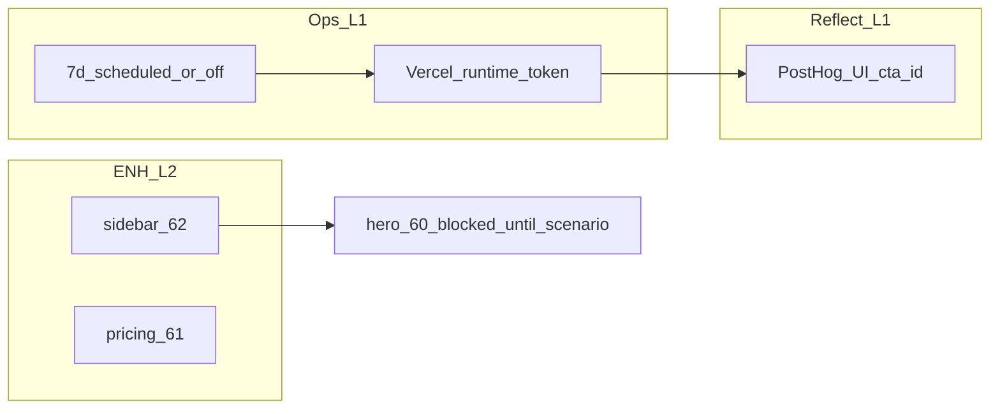

# Active Context — Elevate

**Agent workflow SoT (INIT→ARCHIVE, L1–L4, gstack 보조):** [`AGENTS.md`](../AGENTS.md) § **AI orchestration → Operating model** — 에이전트·인간 모두 **복잡도에 맞는 페이즈**를 생략하지 않음(사용자 fast path만 예외).

## Current Phase — **OPERATIONS + CONTENT** (2026 Q2)

**SoT:** [`memory-bank/operations-mode-2026-q2.md`](../memory-bank/operations-mode-2026-q2.md) · **주간 플랜:** [`memory-bank/content-plan-weekly.md`](../memory-bank/content-plan-weekly.md) · **Tasks:** [`memory-bank/tasks.md`](tasks.md) (§ Operations mode).

**Docs harness (2026-05-07):** `tasks.md` **Docs harness** 행 갱신 완료; **스크립트 미실행** = **Ops 게이트 완료 아님**(문서 유지보수) — [`docs/AI_ORCHESTRATION.md`](../docs/AI_ORCHESTRATION.md) §2.5.

**Product BUILD pause:** #60·#61·#62·#73, Prompt Studio MVP — deferred per operations doc. **가게점수** 별도 레포 — Elevate 세션에서 구현 **금지**.

**North Star:** [`creative-elevate-ai-pivot.md`](../memory-bank/creative-elevate-ai-pivot.md) — 기록 유지, **실행 일시 중단** (문서 상단 배너).

### PostHog · content-ops 증거 (ADR-013 STAB **closed** — 운영 모드에서도 유지)

**DB 052 (MICE drop) — operator-run:** 절차 고정 [`docs/operations/RUNBOOK-drop-mice-schema-052.md`](../docs/operations/RUNBOOK-drop-mice-schema-052.md). **적용 일시·프로젝트 ref·백업 증거**: 에이전트 환경에서는 원격 DB 백업/`052` 실행/`pnpm db:types` 미실행 — 운영자가 RUNBOOK §4 한 줄 증거 작성 후 `db:types` diff·`pnpm verify`.

**이 세션 SoT:** [`memory-bank/tasks.md`](tasks.md) **§ Active session — PostHog STAB**. **갱신 (2026-05-05):** 프로덕 **elevate.ai.kr** 운영 스모크(6 cold `cta_id`) + PostHog **358775** allowlist HogQL — **14/14** `cta_id` **7d hits ≥ 1** · STAB **`[x]`**. 증거: [`reports/posthog-mcp-recheck-2026-05-05-operator-smoke.json`](../reports/posthog-mcp-recheck-2026-05-05-operator-smoke.json) · REFLECT [`reports/reflect-adr013-posthog-2026-05-05.md`](../reports/reflect-adr013-posthog-2026-05-05.md). **의도적 제외(PENDING):** [`tasks.md`](tasks.md) **Explicit PENDING** 표.

**다음 작업 / 모드:** **Ops** (INIT 확정 2026-05-05) — **PLAN→BUILD**는 Gate51 7d trend **PENDING** 분기부터: 증거 [`reports/content-ops-gate51-trend-recheck-latest.json`](../reports/content-ops-gate51-trend-recheck-latest.json) **`"status": "PENDING"`** (`generatedAt`: **2026-05-07T07:32:31.830Z**; 세션 [`reports/content-ops-gate51-trend-recheck-2026-05-07T073231Z.json`](../reports/content-ops-gate51-trend-recheck-2026-05-07T073231Z.json); 파일 스냅샷: **`pnpm run content-ops:gate51-trend-check:write-latest`** 또는 **`pnpm exec tsx scripts/content-ops-gate51-trend-check.ts --out=reports/…json`** — `scripts/content-ops-gate51-trend-check.ts` (**`--out`이면 stdout 비출력**); 파이프용 JSON stdout: **`pnpm run -s content-ops:gate51-trend-check`** (`--out` 없음)). **24h gate-check:** [`reports/2026-05-07T073232Z-content-ops-gate-check.json`](../reports/2026-05-07T073232Z-content-ops-gate-check.json) (`generatedAt`: **2026-05-07T07:32:32.957Z**) — **#49/#50 PASS**, **#51 PENDING** (`sampleCount24`: 0). **O1** runs-invariant **WARN** (heartbeat **yellow**) — [`reports/runs-invariant-recheck-latest.json`](../reports/runs-invariant-recheck-latest.json) (`2026-05-07` 스냅샷) · PostHog STAB는 **closed** (`tasks.md` **INIT — 오늘 트랙**).

**직전 측정 (2026-05-05 UTC):** PostHog HogQL(358775) — `elevate_marketing_cta_click` **total 17** (allowlist 7d **14/14**). 사전 MCP-only 스냅샷(8/14): [`reports/posthog-mcp-recheck-2026-05-05.json`](../reports/posthog-mcp-recheck-2026-05-05.json). HTML `phc_`: [`reports/posthog-prod-html-preflight-latest.json`](../reports/posthog-prod-html-preflight-latest.json).

**Ops O2:** [`reports/2026-05-04-ops-o2-automation-run-smoke.json`](../reports/2026-05-04-ops-o2-automation-run-smoke.json) — **PASS** `2026-05-04T04:41:20Z` (`daily_generation`). 스모크는 시나리오 실행 — 과호출 주의.

**직전 Ops O1 + gate 갱신 (2026-05-07 UTC):** `content-ops:runs-invariant-check` — [`reports/runs-invariant-recheck-latest.json`](../reports/runs-invariant-recheck-latest.json) · detail [`reports/2026-05-07T073232Z-runs-invariant-recheck.json`](../reports/2026-05-07T073232Z-runs-invariant-recheck.json) (**WARN**, yellow, **89** rows / 168h; `automation_heartbeat_yellow_review_idle_vs_stuck`). 이전 스냅샷: [`reports/2026-05-06T030024Z-runs-invariant-recheck.json`](../reports/2026-05-06T030024Z-runs-invariant-recheck.json) (**PASS**, green, **98** rows). **`content-ops:gate-check`:** [`reports/2026-05-07T073232Z-content-ops-gate-check.json`](../reports/2026-05-07T073232Z-content-ops-gate-check.json) (`generatedAt`: **2026-05-07T07:32:32.957Z**) (**#49/#50 PASS**, **#51 PENDING**). **Gate51 trend:** [`reports/content-ops-gate51-trend-recheck-latest.json`](../reports/content-ops-gate51-trend-recheck-latest.json) — **`PENDING`** (`generatedAt`: **2026-05-07T07:32:31.830Z**; 세션 [`reports/content-ops-gate51-trend-recheck-2026-05-07T073231Z.json`](../reports/content-ops-gate51-trend-recheck-2026-05-07T073231Z.json); 이전 [`reports/content-ops-gate51-trend-recheck-2026-05-07T073006Z.json`](../reports/content-ops-gate51-trend-recheck-2026-05-07T073006Z.json)). **Content queue:** [`reports/content-queue-agent-review-2026-05-05.md`](../reports/content-queue-agent-review-2026-05-05.md) · PLAN [`docs/features/PLAN-content-queue-claude-gate-ux.md`](../docs/features/PLAN-content-queue-claude-gate-ux.md) §7–9.

### PLAN — 슬라이스 체크리스트 (갱신)

- [x] **Ops O2:** prod `automation-run` **토큰 스모크 PASS** — [`reports/2026-05-04-ops-o2-automation-run-smoke.json`](../reports/2026-05-04-ops-o2-automation-run-smoke.json) (`200`, `2026-05-04T04:41Z`). **과호출 주의** (`daily_generation`).
- [x] **PostHog ADR-013:** 토큰은 **2026-05-05** 기준 프로덕 `/en` HTML(RSC)에서 확인; **운영 스모크 후** allowlist HogQL **14/14** `cta_id` **7d hits ≥ 1** · STAB **`[x]`**. 증거: [`reports/posthog-mcp-recheck-2026-05-05-operator-smoke.json`](../reports/posthog-mcp-recheck-2026-05-05-operator-smoke.json) · REFLECT [`reports/reflect-adr013-posthog-2026-05-05.md`](../reports/reflect-adr013-posthog-2026-05-05.md) · HTML [`reports/posthog-prod-html-preflight-latest.json`](../reports/posthog-prod-html-preflight-latest.json).
- [x] **#62:** `creative-dashboard-sidebar.md` — 안 **B**(#60 Productions 정책 합의 전 착수 보류); 마이크로 a11y·내비 이벤트는 병행 가능.
- [x] **#60 / #61:** 이번 BUILD 세션 **히어로·pricing 코드 PR 없음** (기존 SoT 유지).

### 다음 세션 예약

- **Cursor 하네스:** **`tasks.md` Skill-first INIT `[x]`** (2026-05-06 — 팀 채택 가정 반영); 새 Cursor 세션 기본은 **`@elevate-work-harness` + 목표 한 줄** — [`docs/MEMORY_BANK_SKILL_GUIDE.md`](../docs/MEMORY_BANK_SKILL_GUIDE.md) § 팀 온보딩 한 줄 · P2 Hooks·`#73` 구현은 여전히 별도 PLAN.
- **PostHog §5 breadth:** **완료** — [`reports/posthog-mcp-recheck-2026-05-05-operator-smoke.json`](../reports/posthog-mcp-recheck-2026-05-05-operator-smoke.json). 다음은 **Explicit PENDING** 또는 ENH 트랙.
- **Explicit PENDING:** [`tasks.md`](tasks.md) **Explicit PENDING** 표(Ops O2, 7d streak, #60·#61·#62, #73 등).
- **CREATIVE:** #62 안 B는 #60과 Productions 노출 합의 후.

**INIT 종료:** 후보 트랙 **Ops | PostHog | #62 | #60 | #61** 집합·실행 순서는 아래 표 유지.

### PLAN — 이번 웨이브 실행 순서 (고정)

| 순서 | 트랙 | 이유 | 다음 모드 |
|------|------|------|-----------|
| 1 | **Ops** (O1→O2) | 제품 분기와 무관, 증거·운영만 | BUILD(스냅샷/스모크) 또는 `tasks.md` automation-off 한 블록 |
| 2 | **PostHog ADR-013** | STAB **`[x]`** (2026-05-05 운영 스모크 + MCP) | 유지 모니터링만; 새 BUILD 불필요 |
| 3 | **#62** | CREATIVE SoT 있음; Productions 노출만 #60과 겹침 | CREATIVE 보강 → BUILD |
| 4 | **#60** | 히어로 **구현 PR** 금지 유지 | 이슈·시나리오 합의·CREATIVE만; 합의 후 BUILD |
| 5 | **#61** | #62와 라우트/컴포넌트 충돌 시 순서 조정 | 스코프 확정 후 BUILD |

**직전 BUILD 참고:** #62 — [`TOC.tsx`](../src/components/desk/TOC.tsx), `elevate_dashboard_sidebar_nav_click`, [`dashboard-sidebar-nav-analytics.test.ts`](../tests/unit/dashboard-sidebar-nav-analytics.test.ts).

**직전 아카이브:** [`archive/work-history/archive-ai-native-workflow-docs-ops-2026-05-04.md`](archive/work-history/archive-ai-native-workflow-docs-ops-2026-05-04.md).

**SoT:** [`tasks.md`](tasks.md) · **PLAN 슬라이스(병행):** 아래 표·다이어그램 — Pkg-E62 진입 전 CREATIVE 확장 완료.

### PLAN — 목표·범위

| 구분 | 내용 |
|------|------|
| **목표** | (A) content-ops **7 UTC일** 증거 또는 automation-off 명시 (B) **ADR-013 PostHog** §5 게이트 진행·문서화 (C) ENH **#62 선행** 후 #60/#61과 병렬 가능 범위만 (D) **#73** P2는 합의 후에만 구현 PR |
| **범위 밖** | P2 Hooks/MCP/CI **구현**(#73 합의 전) · #60 **히어로 PR**(시나리오 코멘트 전) · 임계값·게이트 수치 임의 하향 |

### PLAN — 작업 패키지 (순서·의존성)

1. **Pkg-O1 (Ops, L1):** 일별 `scheduled` 유지 또는 `tasks.md`에 automation-off 한 블록 → `runs-invariant-check` + `reports/*.json`.
2. **Pkg-O2 (Ops, L1):** Vercel `CONTENT_OPS_AUTOMATION_RUNTIME=cursor` + prod `automation-run` **Vercel 토큰** 스모크(401 해소 확인). RUNBOOK·`.env.local.example`은 이미 문서 정합; **대시보드만** operator.
3. **Pkg-R1 (REFLECT, L1):** PostHog ADR-013 **완료** (2026-05-05) — [`reports/posthog-mcp-recheck-2026-05-05-operator-smoke.json`](../reports/posthog-mcp-recheck-2026-05-05-operator-smoke.json). MCP 0건 역사: [`reports/reflect-adr013-posthog-2026-05-04.md`](../reports/reflect-adr013-posthog-2026-05-04.md) 참고.
4. **Pkg-E62 (ENH, L2):** [#62](https://github.com/plancy-dev/elevate/issues/62) — `creative-dashboard-sidebar.md`와 5 locale; **BUILD 시 `pnpm verify`**.
5. **Pkg-E61 (ENH, L2, 병렬 가능):** [#61](https://github.com/plancy-dev/elevate/issues/61) — #62와 파일 충돌 시 순서 조정.
6. **Pkg-P2 (프로세스만):** [#73](https://github.com/plancy-dev/elevate/issues/73) 체크 3항 **합의** → 그다음에만 doc-gate §2 밖 구현 PR 분할.

### PLAN — 성공 기준 (이 슬라이스)

- **Ops:** `meetsSevenConsecutiveCalendarDays=true` **또는** `tasks.md` automation-off + invariant PASS 유지.
- **ADR-013:** **14/14** 7d 비제로 검증 완료 · STAB **`[x]`** — [`reports/posthog-mcp-recheck-2026-05-05-operator-smoke.json`](../reports/posthog-mcp-recheck-2026-05-05-operator-smoke.json).
- **#62:** Phase 1 REFLECT 완료 + Phase 2 partial(aria-current·sidebar PostHog) — DoD 나머지(13→4~5·전면 a11y)는 CREATIVE→BUILD.
- **#73:** 이슈 체크박스에 합의/보류 기록(코드 불필요).

### 다음 모드 (슬라이스 일반)

- **PostHog STAB:** **닫힘** — 다음 세션은 Ops / ENH 트랙 (`tasks.md` § 다음 작업).
- Pkg-O1~O2·R1만 → **BUILD(증거)** 또는 **REFLECT** 짧게 → **ARCHIVE** 한 줄.  
- Pkg-E62/E61 → **CREATIVE** 완료(위 링크) → **BUILD** → **REFLECT**.  
- 스킬 선호 시: [`MEMORY_BANK_SKILL_GUIDE.md`](../docs/MEMORY_BANK_SKILL_GUIDE.md) · Skill-first 게이트는 [`tasks.md`](tasks.md) PLAN 에픽 체크박스.

**운영 앵커 (지속):** prod `automation-run` GET은 **Vercel 토큰**으로 operator 실행 · 7 UTC일 스트릭은 [`memory-bank/tasks.md`](tasks.md) Immediate Next Step.

## Prior REFLECT — 증거 로그 (2026-05-03)

**Runs invariant:** [`reports/2026-05-03-runs-invariant-recheck.json`](../reports/2026-05-03-runs-invariant-recheck.json) — `PASS`, `maxConsecutiveUtcDaysWithScheduled=2`. **Prod 스모크:** elevate.ai.kr + `.env.local` 토큰 → **401** (Vercel 시크릿과 다를 때 예상). **BUILD:** `947cff1` / `8b17591` — content-ops auth + invariant recheck. **Positioning:** [`docs/adr/ADR-012-positioning-2026-q2-scenario-a-media-first.md`](../docs/adr/ADR-012-positioning-2026-q2-scenario-a-media-first.md); #60 [retract/reframe](https://github.com/plancy-dev/elevate/issues/60#issuecomment-4365916803).

### Stabilization ops — `trigger_type` / `automation_source` (7d calendar)

**Branch:** `main`  
**Focus SoT:** `memory-bank/tasks.md`  
**Prioritized backlog:** `reports/prioritized-backlog-expert-2026-05-03.md`

## Objective

- Close `tasks.md` checklist item for **7 consecutive UTC days** with ≥1 `scheduled` `content_runs` (same DB as prod ops) **or** explicit operator **automation-off** note.
- Re-run `pnpm run content-ops:runs-invariant-check` and refresh `reports/*-runs-invariant-check.json` when extending the observation window.

## Current State

- **gate51:** 아카이브 스냅샷(2026-05-03) **PASS** — `reports/gate51-snapshots/2026-05-03-gate51-pass-multiday.json`. **트렌드 스크립트 최신:** [`reports/content-ops-gate51-trend-recheck-latest.json`](../reports/content-ops-gate51-trend-recheck-latest.json) — **PENDING** (`generatedAt`: **2026-05-05T10:26:50Z**; 갱신: **`pnpm run content-ops:gate51-trend-check:write-latest`** 또는 **`pnpm run content-ops:gate51-trend-check -- --out=reports/…json`** — **`--out`이면 stdout 비출력·JSON은 파일**).
- **P0 #2 / #3:** 최신 스냅샷 [`reports/2026-05-04-runs-invariant-check.json`](../reports/2026-05-04-runs-invariant-check.json) (`generatedAt=2026-05-04T02:16:16.229Z`) — **PASS**, `maxConsecutiveUtcDaysWithScheduled=2`. (직전: [`reports/2026-05-03-runs-invariant-recheck.json`](../reports/2026-05-03-runs-invariant-recheck.json).) **Prod GET:** elevate.ai.kr + 로컬 env 토큰 → **401** (Vercel에 등록한 값과 불일치 시 예상).
- Queue automation `#55`–`#59` complete; stabilization `#49`/`#50`/`#51` gates passed per `tasks.md`.
- **Recheck (2026-05-03):** [`reports/2026-05-03-runs-invariant-recheck.json`](../reports/2026-05-03-runs-invariant-recheck.json) — PASS, streak **2**. **Prod `automation-run` GET (로컬 `.env.local` 토큰):** **401** — 운영 검증은 **Vercel `CONTENT_OPS_AUTOMATION_TOKEN`과 바이트 동일**한 값으로 curl(비밀 미기록).

## Next Immediate Execution Anchors

1. Keep **daily** `scheduled` activity until **7** consecutive UTC days register in `content_runs`, then re-run `pnpm run content-ops:runs-invariant-check` (merge consecutive-day stats into the JSON snapshot pattern used in `reports/2026-05-03-runs-invariant-check.json`).
2. Optional rhythm: `pnpm run content-ops:gate-check` if publish-path gates need corroboration.
3. Code change only if invariant script contract is wrong — otherwise **ops + evidence**.

## Non-Negotiable Safety Constraints

- Do not lower `CONTENT_OPS_GATE51_MIN_DAY_BUCKETS` in production to fake PASS without explicit design sign-off.
- Do not treat metric deltas as valid without capturing full gate51 JSON (`trend`, `decisionReason`).
