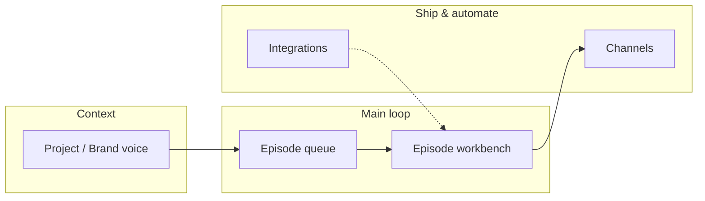

# CREATIVE — Production “Studio Hub” UX

**Status:** Design lock for BUILD (supersede only via explicit ADR or revision here).  
**Aligns with:** [`docs/design/VISUAL_LANGUAGE_V2.md`](../docs/design/VISUAL_LANGUAGE_V2.md), [`docs/design/DASHBOARD_UX_PRINCIPLES.md`](../docs/design/DASHBOARD_UX_PRINCIPLES.md), [`creative-elevate-ai-pivot.md`](creative-elevate-ai-pivot.md).

---

## 1. Problem statement

제작(Production) 영역이 **관리자 CRUD**처럼 읽힌다: 동급 보조 버튼 나열, 긴 설명 문단, 프로젝트 목록 아래 긴 생성 폼, 이중 CTA. 크리에이터 페르소나에 맞으려면 **장식 폭발**이 아니라 **한 가지 명확한 스튜디오 루프**(맥락 → 큐 → 작업)가 보여야 한다.

---

## 2. North star (one sentence)

**“지금 어떤 브랜드(프로젝트)로 일하는지”가 항상 보이고, 그 아래에 “에피소드 대기열”이 중심인 단일 허브** — 보조 기능(채널·연동)은 같은 무게로 경쟁하지 않는다.

---

## 3. Design constraints (non-negotiable)

| Constraint | Implication |
|------------|-------------|
| VISUAL_LANGUAGE_V2 P1–P6 | 한 뷰포트 밴드당 **한 액센트**; 깊이 **최대 2**; 모션 **120–180ms**, `prefers-reduced-motion` |
| DASHBOARD_UX_PRINCIPLES | 플로팅 카드 남발 금지; **단일 `rounded-xl` + `divide-y` 큐** 선호; 사이드바는 짧은 마커 패턴 |
| Product shell | **Blue**만 인터랙티브 액센트; 마케팅 오렌지는 Production에 쓰지 않음 |

**창의성의 정의(이 프로젝트에서):** 그라데이션·일러스트 추가가 아니라 **정보 위계 + 메타포(큐/워크스페이스) + 점진적 공개**로 “도구가 손에 익는다”는 느낌.

---

## 4. User mental model

- **Primary:** Project → Episodes → Episode detail/workbench.  
- **Secondary:** Distribution and API keys support the loop; they are **not** peer tabs in the user’s head.

---

## 5. IA decision

### 5.1 Chosen: **Single hub + persistent project context**

| Element | Role |
|---------|------|
| `/dashboard/productions` | **Studio Hub**: project switcher + episode queue + one primary “New episode” |
| `?project=` | 유지: 공유 가능한 딥링크, 필터 SoT |
| `/dashboard/productions/projects` | **Phase 1:** 유지하되 역할 축소 → “모든 프로젝트 관리” + 생성은 허브/모달에서도 가능. **Phase 2 옵션:** 허브만으로 충분하면 라우트를 얕게 리다이렉트하거나 설정 하위로 이동 (별도 ADR) |

### 5.2 Rejected alternatives

| Option | Why rejected |
|--------|----------------|
| A. 완전 단일 페이지(프로젝트 URL 제거) | 딥링크·북마크·온보딩에서 프로젝트별 진입 가치가 큼 |
| B. 채널/연동을 상단 3버튼과 동일 시각 무게 유지 | 사용자가 “무엇이 주 루프인지” 혼란 — 현재 문제 재현 |
| C. 카드 그리드로 에피소드 나열 | V2·대시보드 원칙과 충돌; 스캔·밀도 면에서 **단일 리스트 큐**가 유리 |

---

## 6. Screen-level decisions

### 6.1 Studio Hub (`productions/page.tsx`)

| Decision | Spec |
|----------|------|
| Header | **한 줄 제목** + **한 줄 서브**(선택); 긴 블록 설명은 제거하거나 **접기/도움말**로 이동 |
| Project control | **컴팩트 스위처**(현재 프로젝트명 · 에피소드 수 · 변경 드롭다운). “전체” 옵션 유지 시에도 동일 컴포넌트 |
| Secondary actions | 채널·연동·(프로젝트 목록)은 **하나의 “스튜디오 설정” 또는 툴바**로 묶거나 **텍스트 가중치 낮은** 링크/아이콘 버튼 |
| Primary CTA | **화면당 Primary 하나**: “새 에피소드”. 중복 CTA는 빈 상태에서만 보조적으로 허용하거나 스타일 차등 |
| Episode list | **단일 컨테이너 + 행 호버**; 행에 제목 · 상태 · (옵션) 썸네일 자리 · 업데이트 시각 |
| Empty state | **한 문장 + Primary**; 세부 안내는 링크/툴팁 |

### 6.2 Projects page (`productions/projects/page.tsx`)

| Decision | Spec |
|----------|------|
| 목록 우선 | 프로젝트가 1개 이상이면 **목록이 뷰포트 상단**에; 생성 폼은 **모달** 또는 **접이식 “새 프로젝트”** |
| 빈 상태 | **온보딩형 단일 패널**(이름 → 설명 선택 → 브랜드 가이드는 접기/2단계) |
| Brand guide field | 긴 textarea는 유지하되 **Phase 1.5:** 위에 **톤 칩(선택)** 또는 **프리셋 한 줄 삽입** 슬롯 추가 가능 (별도 작은 CREATIVE 보충) |

### 6.3 Cross-links

- 프로젝트 카드/행 클릭 → `productions?project=id` (기존 동작 유지).  
- 허브의 스위처 ↔ URL 동기화(이미 `project` 쿼리와 정합).

---

## 7. Component inventory (BUILD hint)

| Piece | Likely implementation |
|-------|------------------------|
| `ProductionsProjectSwitcher` | Client or server wrapper: reads projects, syncs `?project=`, accessible combobox |
| `ProductionsHubToolbar` | Links: 프로젝트 관리, 배포 채널, 도구 연동 — **secondary** 스타일 통일 |
| `ProductionsEpisodeQueue` | Presentational list; 단일 border container + divide-y |
| `StudioEmptyState` | 제목/설명/cta 슬롯 재사용 가능한 패턴 |

새 **마케팅 전용** 색/그라데이션 컴포넌트는 추가하지 않는다.

---

## 8. Motion

- 리스트 행 hover: 배경 `layer-02`, **150ms** 내외.  
- 프로젝트 전환 시: **콘텐츠 페이드 선택**(reduced-motion 시 즉시 교체).  
- 모달 열림: V2 깊이 3 허용 구역(다이얼로그)만.

---

## 9. Content / i18n

- 허브 짧은 헤더용 키 분리: `productionsHubTitle`, `productionsHubSubtitle` (기존 긴 `listIntro` 등과 분리).  
- “도움말” 블록은 `productionsHubHelp` 같은 **접기 섹션** 키로.  
- 모든 로케일 동시 추가 (`messages-locale-parity`).

---

## 10. Phased rollout

| Phase | Scope | Done when |
|-------|--------|-----------|
| **P0** | 카피 단축 + CTA 단일화 + 빈 상태 정리 | 허브에 긴 설명 의존 없이 주 루프 이해 가능 |
| **P1** | 프로젝트 스위처 + 툴바(보조 링크 정리) | URL·필터 기존 동작 유지, 스크롤 감소 |
| **P2** | 프로젝트 페이지: 생성 폼 모달/접기 | 목록이 항상 위 |
| **P3** | 브랜드 가이드 톤 칩/프리셋(선택) | 입력이 “벽”이 아니라 단계적으로 느껴짐 |

---

## 11. Open questions (pre-BUILD)

1. 에피소드 행 **썸네일**은 데이터가 없을 때 플레이스홀더만 할지, Phase 2로 미룰지.  
2. 모바일에서 스위처를 **바텀시트**로 할지, **풀폭 셀렉트**로 할지.  
3. `ENABLE_STUDIO_DEMO_SEED` 패널이 허브에서 **접기** 가능한지(개발용 가시성).

---

## 12. Relation to tasks

구현 시 `memory-bank/tasks.md`에 “Production Studio Hub P0–P2” 항목을 추가하고, 완료 후 `activeContext.md` 앵커를 허브 컴포넌트 경로로 갱신한다.
